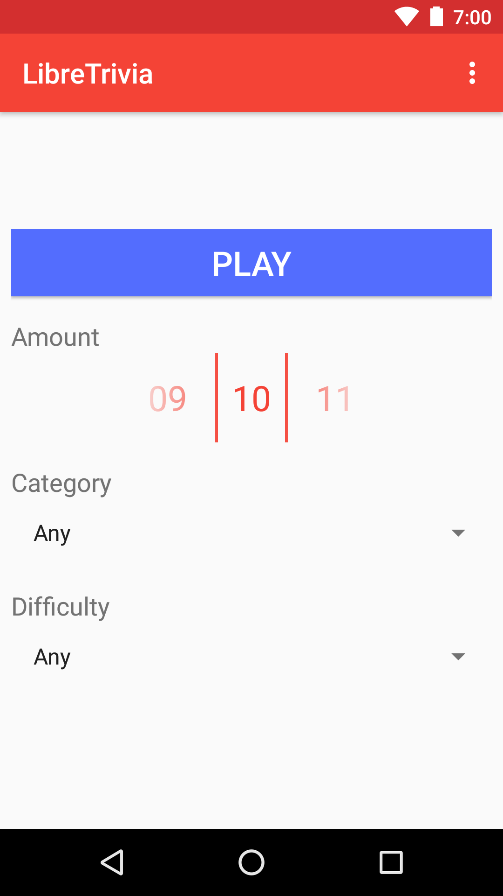
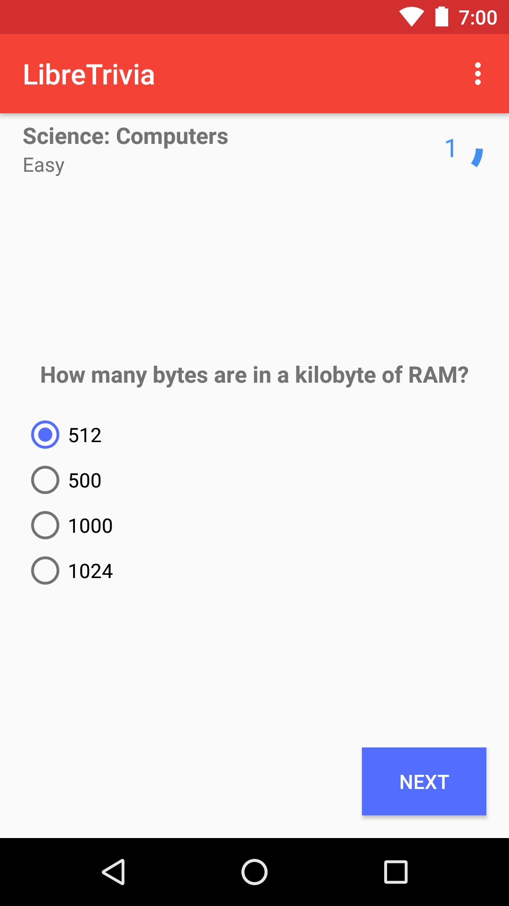
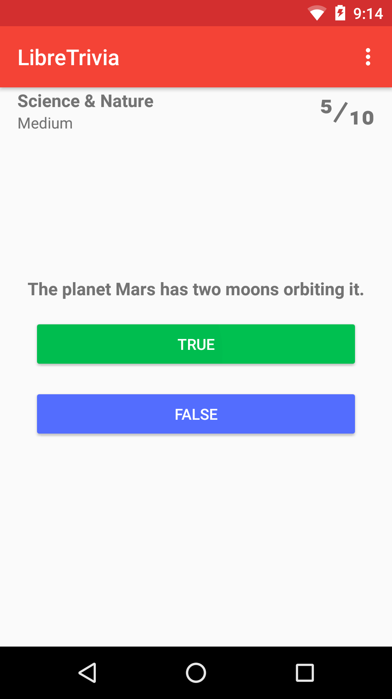
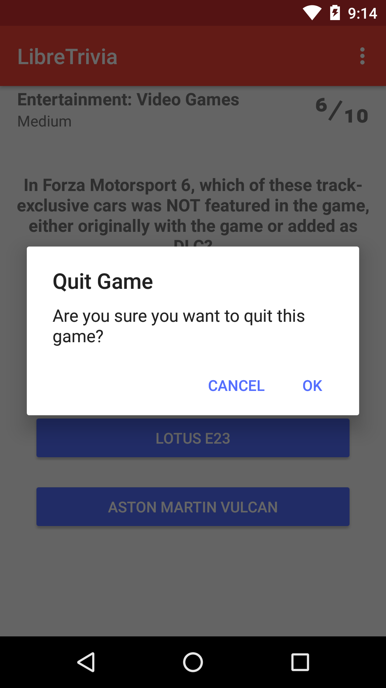
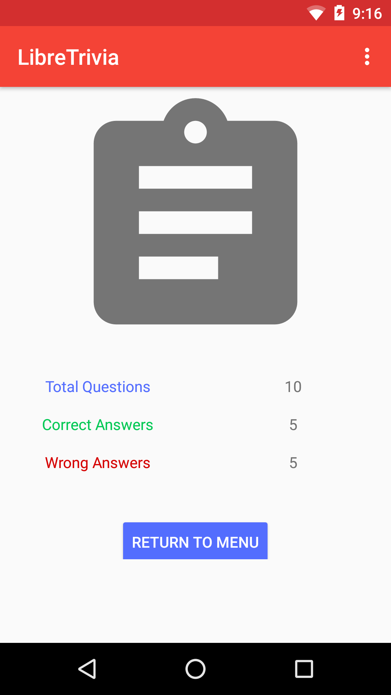

<h2 align="center"><b>LibreTrivia</b></h2>
<h4 align="center">An Open Source Trivia Game for Android</h4>

## Screenshots

## Description

A simple Trivia game for Android that uses the [Open Trivia Database](https://opentdb.com/).

# Contribution

If you are a developer and wish to contribute to the app, please fork the project and submit a pull request.

## License

LibreTrivia is Free Software: You can use, study share and improve it at your
will. Specifically you can redistribute and/or modify it under the terms of the
[GNU General Public License](https://www.gnu.org/licenses/gpl.html) as
published by the Free Software Foundation, either version 3 of the License, or
(at your option) any later version.
